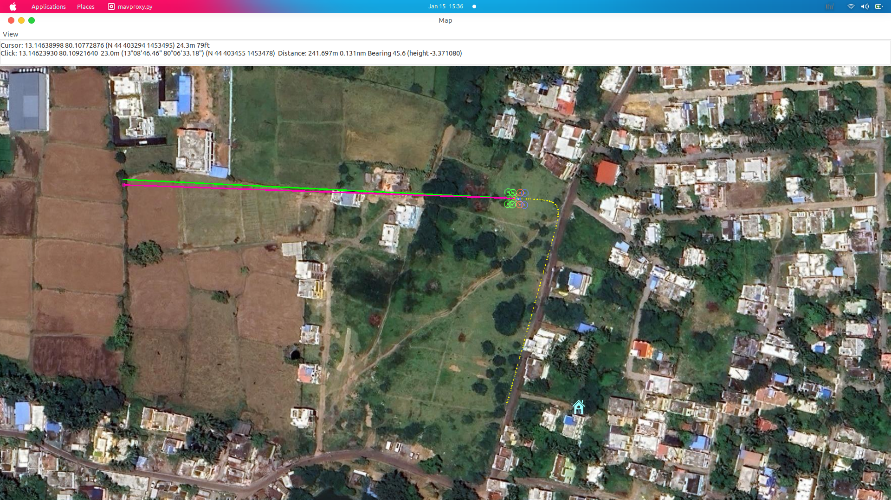
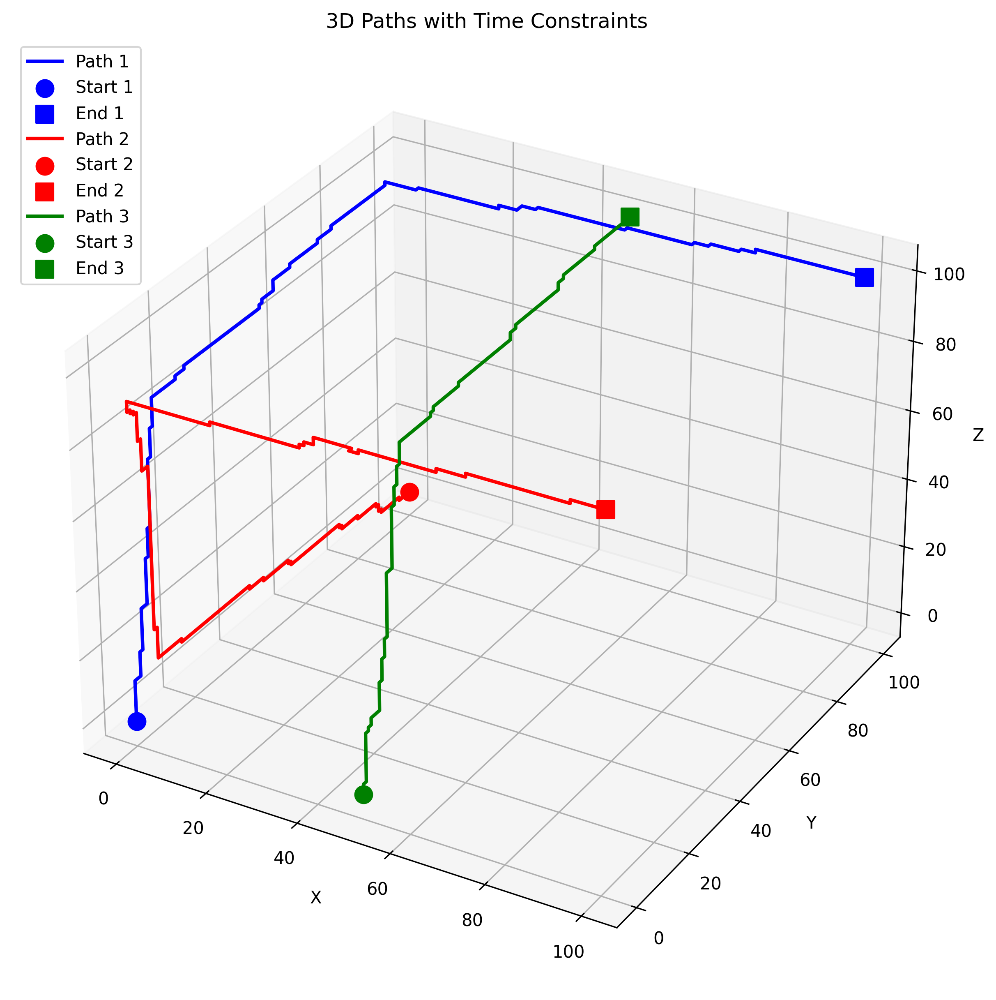
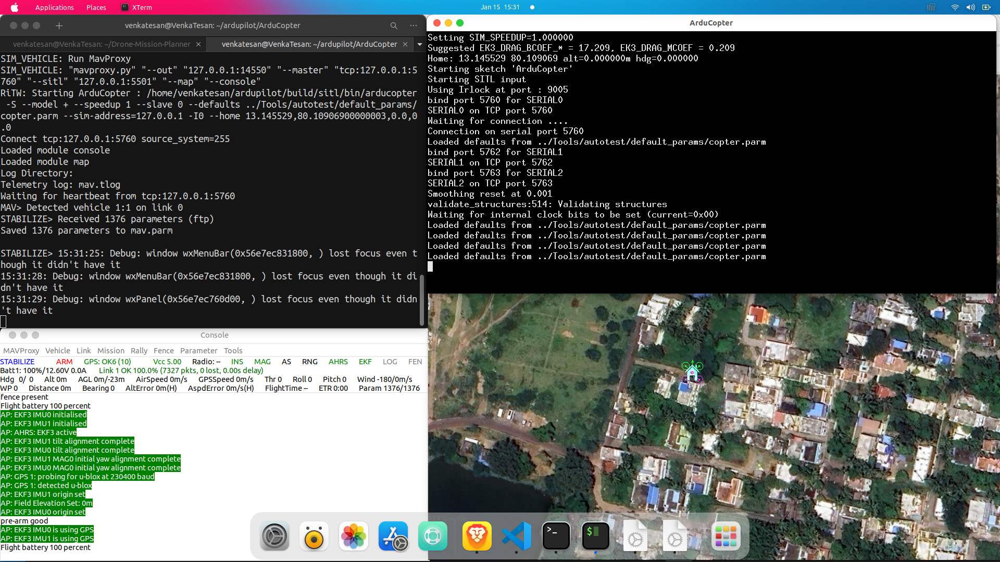
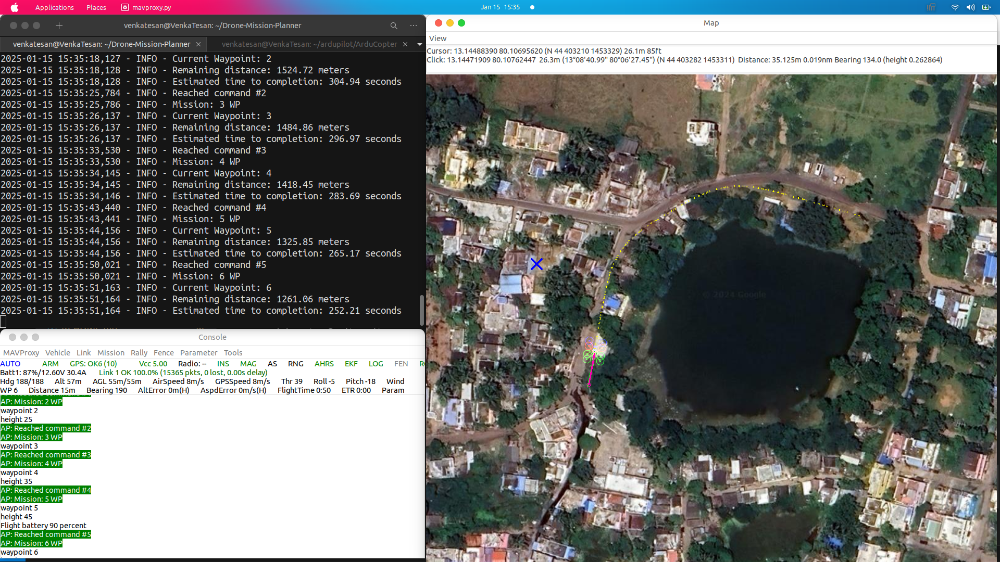
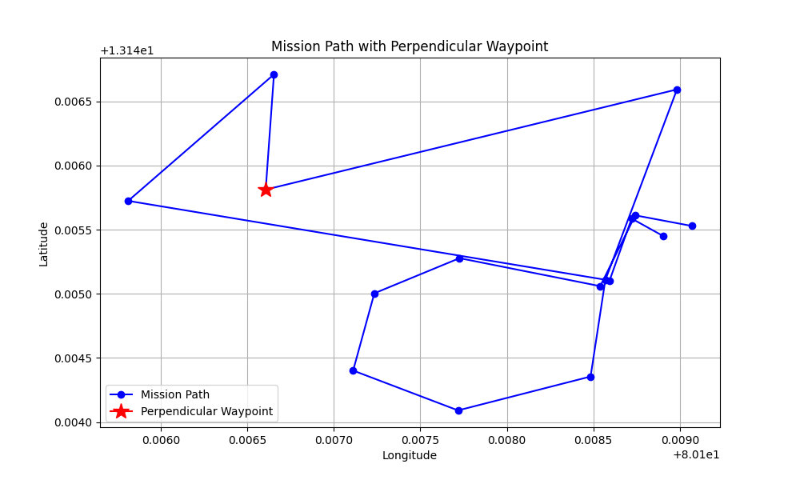

# Drone-Mission-Planner
A comprehensive Python-based project for 3D path planning and autonomous drone missions using DroneKit and MAVLink. The project consists of two main components:

- A 3D path planning algorithm for collision-free multi-agent routing
- An autonomous drone mission planner with dynamic waypoint adaptation
<br/>
</hr>


## Tech Stack
<div style="display:flex; justify-content:space-around;">
    <a href="https://www.python.org/"></a>
    <a href="https://dronekit.io/"></a>
    <a href="https://ardupilot.org/"></a>
    <a href="https://mavlink.io/"></a>
    <a href="https://matplotlib.org/"></a>
    <a href="https://numpy.org/"></a>
    <a href="https://pandas.pydata.org/"></a>
    <a href="https://www.yaml.io/"></a>
</div>


## Project Structure
```bash
├── config
│   └── default_mission.yaml # contains ‘latʼ, ʼlonʼ, ‘altʼ
├── examples
│   ├── path_planning.py # Question 1
│   └── simple_mission.py # Question 2
├── fix_dronekit.py
├── logs
│   ├── drone_mission.log # Question 2
│   ├── mission_path.png # Question 2
│   └── path_visualization.png # Question 1
├── README.md
├── requirements.txt
├── setup.py
└── src
    ├── mission_planner.py # Question 2
    └── path_planner.py # Question 1
```

## Installation Instructions

### 1. System Requirements
- Python 3.10 or higher
- ArduPilot SITL (for simulation)
- MAVProxy (for connection handling)
- git

### 2. Environment Setup

#### 2.1 Create Virtual Environment
```bash
# Create and activate virtual environment
python -m venv venv
source venv/bin/activate  # On Windows: venv\Scripts\activate
```

#### 2.2 Install ArduPilot SITL
```bash
# Install ArduPilot SITL
git clone https://github.com/ArduPilot/ardupilot.git
cd ardupilot
git submodule update --init --recursive
```

#### 2.3 Install MAVProxy
```bash
# Ubuntu/Debian
sudo apt-get install python3-dev python3-opencv python3-wxgtk4.0 python3-pip python3-matplotlib python3-lxml python3-pygame
pip3 install MAVProxy

# Windows
pip install MAVProxy
```

### 3. Project Installation

#### 3.1 Clone Repository
```bash
git clone https://github.com/Venkatesan-M/Drone-Mission-Planner.git
cd Drone-Mission-Planner
```

#### 3.2 Install Dependencies
```bash
pip install -r requirements.txt
```

### 4. Export path
```bash
export PYTHONPATH=$(pwd)
```
### 5. [DroneKit Error Fix](https://github.com/dronekit/dronekit-python/issues/1132)
When importing the DroneKit module ("import dronekit") under Python 3.10, the "AttributeError: module 'collection' has no attribute 'MutableMapping'" error is raised at the line 2689 ("class Parameters(collections.MutableMapping, HasObservers):") of the "dronekit/__init__.py" file.
This makes DroneKit incompatible (i.e. unusable) with Python 3.10.
Run:
```bash
python fix_dronekit.py
```
This fixes by Replacing "collections.MutableMapping" by "collections.abc.MutableMapping" (in the "dronekit/__init__.py" file).


## Project Explaination
### Question 1
1. Consider a 3D Grid of points from 0,0,0 to 100,100,100 with unit increment in all
axes. Assign higher weights to some of the points randomly, and zero weights for rest of
points. User inputs two or more sets of {start, end points}.
  - a. Starting from a given time, determine shortest path for each set, where velocity of
travel for one grid to another is v m/s such that not two paths should not have a
common point at any time.
  - b. Plot the paths in 3D

### Solution: 
time-aware path planning algorithm on a 3D grid with weighted points. The goal is to compute shortest paths for multiple agents while ensuring no two paths occupy the same grid point at the same time.

### Run the code

```sh
python examples/path_planning.py 
```

### [Algorithm Design and Implementation](./src/path_planner.py)

1. Grid Initialization:
  - A 3D grid of size `(100×100×100)` is created.
  - 10% of the grid points are randomly assigned higher weights (between 5 and 10), making traversal through these points costlier.

2. Shortest Path Algorithm:
  - A* Algorithm: Used for finding the shortest path from a start point to an end point.
  - <b>Heuristic</b>: The Manhattan distance between the current point and the destination is used as the heuristic.
  - <b>Weight Inclusion</b>: The weight of a grid point is added to the travel cost.
  - The open set (priority queue) maintains points sorted by their f-scores, where:
  ```sh
  f(point) = g(point) + h(point)
  ```
  g: Cost from start to the current point, h: Estimated cost to reach the destination.

3. Time Constraints:
  - Each grid point is associated with a set of time steps indicating when it is occupied.
  - A point is considered "free" at a given time if the time step does not exist in its set of occupied times.

4. Marking Points as Occupied:
  - Once a path is computed, each point in the path is marked as occupied at the corresponding time steps, calculated as: 
  - `time_at_point = start_time + distance_from_start / velocity`
 
5. Pathfinding for Multiple Requests:

- Each path request is processed sequentially:
  - If a valid path is found, the path is marked as occupied.
  - If no valid path is found due to conflicts, the algorithm skips that request.

6. 3D Visualization:
- All computed paths are visualized using Matplotlib in 3D.
- Each path is rendered in a distinct color, with markers indicating the start and end points.

## Results of Path Planning

</br>
</hr>
Terminal Output:

```sh
(venv) venkatesan@VenkaTesan:~/Drone-Mission-Planner$ python examples/path_planning.py 
Finding paths...
Calculating path 1...
Path 1 found! Length: 301 points
Calculating path 2...
Path 2 found! Length: 301 points
Calculating path 3...
Path 3 found! Length: 201 points

Plotting paths...
Plot saved to: logs/path_visualization.png
```


### Question 2
2. Make dictionary of 15 waypoints with keys being `lat`, `lon`, `alt`.
- a. Using Dronekit or pymavlink, plan a mission in auto mode using these waypoints
(quadcopter). Drone should land at last waypoint
- b. After 10 waypoints, include a new waypoint to the mission at 100m perpendicular to
the current direction of travel and continue the updated mission
- c. Print at every instance the estimated time and distance to complete the mission.
- d. Plot the path of travel in 2D

### [Algorithm Design and Implementation](./src/mission_planner.py)

### Waypoint Management
- [Default Mission Configuration](config/default_mission.yaml)
```yaml
mission:
  takeoff_altitude: 30
  cruise_speed: 10
  waypoint_acceptance_radius: 5
  default_waypoints:
    - lat: 47.3977419
      lon: 8.5455938
      alt: 50
    # ... more waypoints
```

- The waypoints are a list of dictionaries containing latitude, longitude, and altitude (15 in total initially).
- After reaching the 10th waypoint, a perpendicular waypoint is calculated using the Haversine formula for distance and bearing computation.

1. Mission Upload:

- A flight mission is uploaded to the drone in the form of MAVLink commands, including waypoints, takeoff, and Return-to-Launch (RTL).
- A `NAV_WAYPOINT` command is used for each waypoint.

2. Dynamic Waypoint Addition:
- At the 10th waypoint, a new waypoint is inserted into the existing mission using a 90-degree offset from the current direction.

3. Distance and ETA Calculation:
- The remaining distance is calculated by summing the distances between current and subsequent waypoints.
- ETA is estimated using the remaining distance divided by the cruise speed.

4. Visualization:
- The mission path is plotted in 2D, highlighting the dynamically added perpendicular waypoint.


### Run the code

### 1. Start SITL Simulator
you can change the location for your needs as well but make sure to change the respective waypoints as well
```bash
# Terminal 1: Start SITL
cd ardupilot/ArduCopter
# Replace with your location (home)
sim_vehicle.py -v ArduCopter --console --map --custom-location=13.145529,80.109069,0,0 
```


### 2. Run Mission
Before running the mission, wait till the quad is fully calibrated and it passed the pre-arm check
```bash
# Terminal 2: Run example mission
cd Drone-Mission-Planner
python examples/simple_mission.py
```


### Results
1. Plot of the waypoints traveled path by the drone



2. [Logging Configuration](./logs/drone_mission.log)
- Logs are stored in the `logs/` directory
- Default log level: INFO
- Rotation: Daily

```sh
2025-01-15 15:35:25,786 - INFO - Mission: 3 WP
2025-01-15 15:35:26,137 - INFO - Current Waypoint: 3
2025-01-15 15:35:26,137 - INFO - Remaining distance: 1484.86 meters
2025-01-15 15:35:26,137 - INFO - Estimated time to completion: 296.97 seconds
2025-01-15 15:35:33,530 - INFO - Reached command #3
2025-01-15 15:35:33,530 - INFO - Mission: 4 WP
2025-01-15 15:35:34,145 - INFO - Current Waypoint: 4
2025-01-15 15:35:34,145 - INFO - Remaining distance: 1418.45 meters
2025-01-15 15:35:34,146 - INFO - Estimated time to completion: 283.69 seconds
2025-01-15 15:35:43,440 - INFO - Reached command #4
2025-01-15 15:35:43,441 - INFO - Mission: 5 WP
2025-01-15 15:35:44,156 - INFO - Current Waypoint: 5
2025-01-15 15:35:44,156 - INFO - Remaining distance: 1325.85 meters
2025-01-15 15:35:44,156 - INFO - Estimated time to completion: 265.17 seconds
2025-01-15 15:35:50,021 - INFO - Reached command #5
# ... and more
```